# ARD Resto Mobile BNSP

Aplikasi mobile berbasis Flutter untuk ARD Resto, dibuat sebagai bagian dari proyek **Uji Kompetensi BNSP Batch 3**. Aplikasi ini membantu pengguna menemukan restoran, melihat informasi detail, dan menemukan lokasi restoran dengan mudah.

---

## 📱 Fitur

- **Daftar Restoran**: Lihat daftar restoran yang tersedia.
- **Detail Restoran**: Lihat informasi lengkap tentang restoran seperti foto, menu, rating, dan ulasan.
- **Pencarian Restoran**: Cari dan filter restoran berdasarkan nama, jenis, atau lokasi.
- **Peta Interaktif**: Lihat lokasi restoran di peta secara real-time.
- **Navigasi ke Lokasi Restoran**: Navigasi ke lokasi restoran dengan mudah menggunakan peta.

---

## 🛠️ Teknologi yang Digunakan

### Frontend:
- **Framework**: Flutter _(Framework UI lintas platform berbasis Dart)_
- **State Management**: Flutter Bloc _(Manajemen state dengan mudah dan efisien)_
- **Integrasi Peta**: Flutter Map / Google Maps Flutter (opsional, sesuaikan dengan teknologi yang digunakan)

### Backend (Opsional untuk Integrasi):
- **API**: RESTful API disediakan oleh [ARD Resto Backend](https://github.com/ardelingga/be-ard-resto-mobile-bnsp) *(opsional: tautkan ke repository backend)*.

---

## 🚀 Memulai Proyek

Ikuti langkah-langkah berikut untuk menjalankan aplikasi ini di komputer Anda:

### Prasyarat
Pastikan Anda memiliki software berikut terinstal di komputer:
- [Flutter SDK](https://docs.flutter.dev/get-started/install)
- [Dart](https://dart.dev/get-dart)
- IDE seperti [Android Studio](https://developer.android.com/studio) atau [Visual Studio Code](https://code.visualstudio.com/)

### Instalasi

1. Clone repository ini:
   ```bash
   git clone https://github.com/username/ard_resto_mobile.git
   ```
2. Masuk ke direktori proyek:
   ```bash
   cd ard_resto_mobile_bnsp
   ```
3. Unduh semua dependensi:
   ```bash
   flutter pub get
   ```
4. Jalankan aplikasi di emulator atau perangkat fisik yang terhubung:
   ```bash
   flutter run
   ```

---

## 📂 Struktur Proyek

```plaintext
ard_resto_mobile_bnsp
├── lib/                                            # Folder utama untuk kode aplikasi
│   ├── app.dart                                    # Konfigurasi global aplikasi
│   ├── main.dart                                   # Titik awal aplikasi
│   ├── business_logic/                             # Logika bisnis aplikasi (State Management, Utilities)
│   ├── config/                                
│   │   └── config.dart                             # File konfigurasi aplikasi (API, keys, dll.)
│   ├── data/                                       # Data layer
│   │   ├── constants/                              # Konstanta aplikasi
│   │   │   ├── app_colors.dart                     # Konstanta warna
│   │   │   ├── app_defaults.dart                   # Konstanta nilai default (padding, margin, dll.)
│   │   │   └── app_path_assets.dart                # Jalur direktori aset aplikasi
│   │   ├── models/                                 # Definisi model data (Restoran, Kota, Respons API, dll.)
│   │   ├── providers/                              # Provider untuk komunikasi api
│   │   └── repositories/                           # Repositori untuk pengelolaan data
│   ├── presentation/                               # Lapisan UI untuk aplikasi
│   │   ├── components/                             # Widget yang dapat digunakan ulang
│   │   └── screens/                                # Halaman/screens aplikasi
│   │       ├── home/                               # Halaman utama/Home screen
│   │       │   ├── components/                     # Komponen pendukung untuk halaman home
│   │       │   └── home_screen.dart                # File utama untuk layar home
│   │       ├── restaurants/                        # Halaman restoran
│   │       │   ├── components/                     # Komponen pendukung untuk layar restoran
│   │       │   ├── detail_restaurant_screen.dart   # Halaman detail restoran
│   │       │   └── search_restaurants_screen.dart  # Halaman pencarian restoran
│   │       └── full_page_maps_screen.dart          # Halaman full page maps
├── assets/                                         # Folder untuk menyimpan aset (gambar, ikon, dll.)
├── test/                                           # Unit testing dan widget testing
├── analysis_options.yaml                           # Aturan analisis statis untuk Flutter/Dart
├── pubspec.yaml                                    # File konfigurasi proyek (dependencies, assets, dll.)
└── README.md                                       # Dokumentasi proyek
```

---

## 🌐 Integrasi API

Aplikasi ini terhubung dengan API ARD Resto Backend. Pastikan server backend sedang berjalan untuk menguji fitur live.

Untuk konfigurasi URL atau kunci API:
- Tambahkan konfigurasi API di file `/lib/config/config.dart` (atau buat file serupa).

---

## 🖼️ Tangkapan Layar

Berikut adalah beberapa tangkapan layar aplikasi untuk melihat fitur-fiturnya:

## Android

<table>
  <tr>
    <th>Halaman Home</th>
    <th>Daftar Restoran</th>
    <th>Detail Restoran</th>
  </tr>
  <tr>
    <td>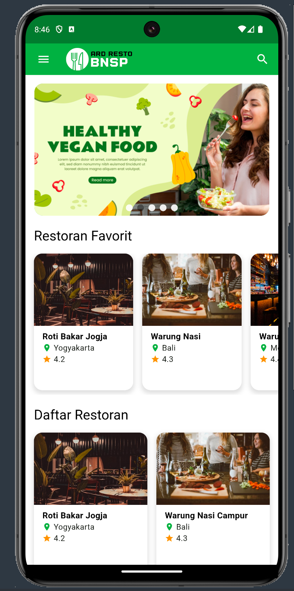</td>
    <td>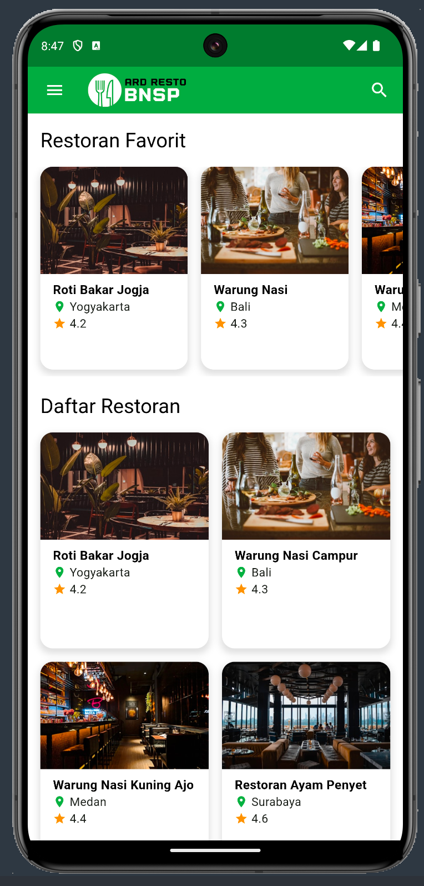</td>
    <td>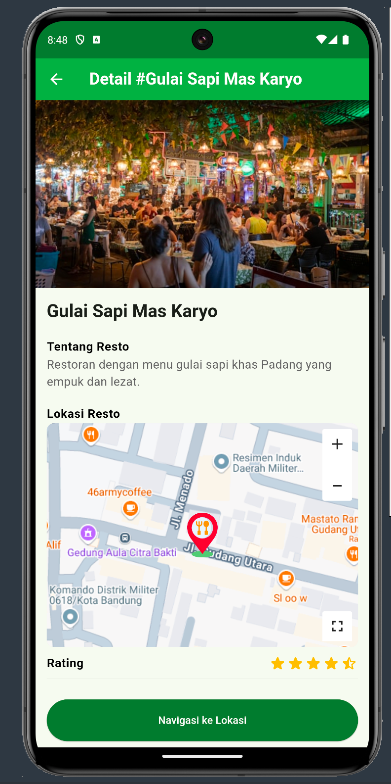</td>
  </tr>
  <tr>
    <th>Pencarian Restoran</th>
    <td>Full Page Location Restaurant</td>
    <td>Navigation to Google Maps</td>
  </tr>
   <tr>
    <td>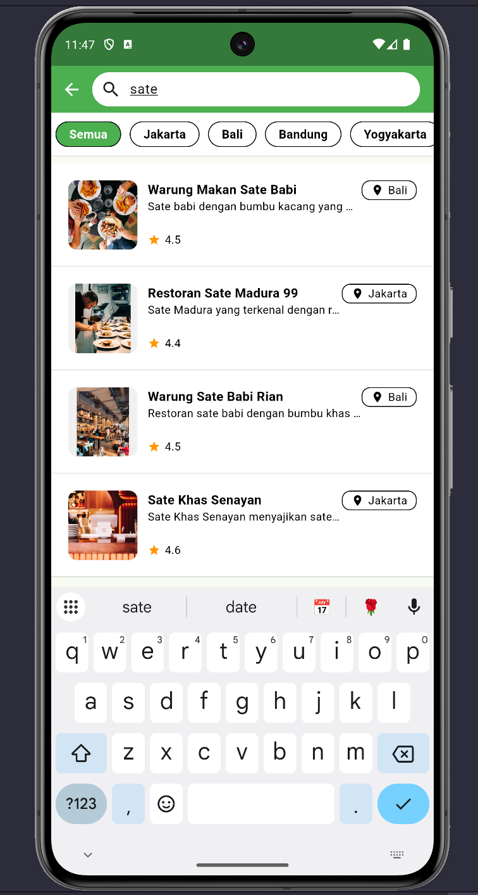</td>
    <td>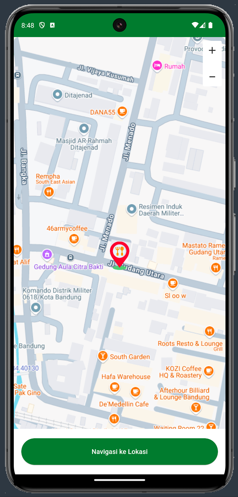</td>
    <td>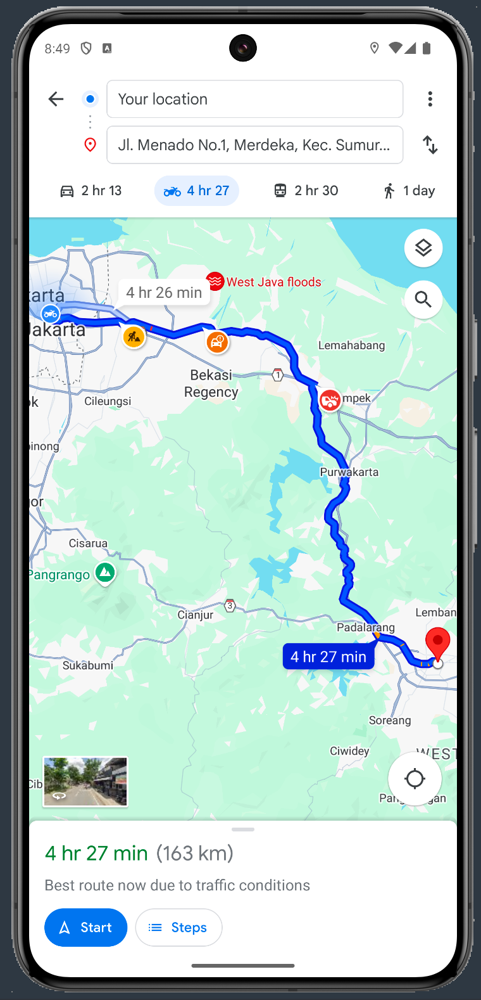</td>
  </tr>
</table>


## iOS

<table>
  <tr>
    <th>Halaman Home</th>
    <th>Daftar Restoran</th>
    <th>Detail Restoran</th>
  </tr>
  <tr>
    <td>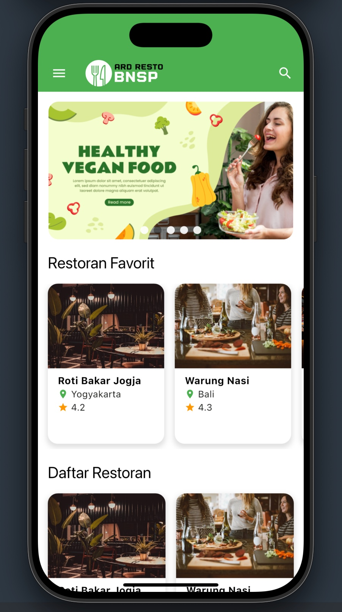</td>
    <td>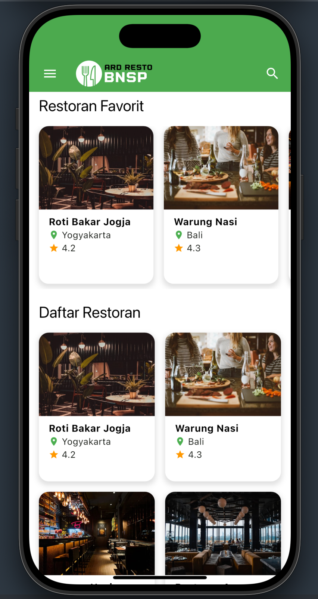</td>
    <td></td>
  </tr>
  <tr>
    <th>Pencarian Restoran</th>
    <td>Full Page Location Restaurant</td>
    <td>Navigation to Google Maps</td>
  </tr>
   <tr>
    <td>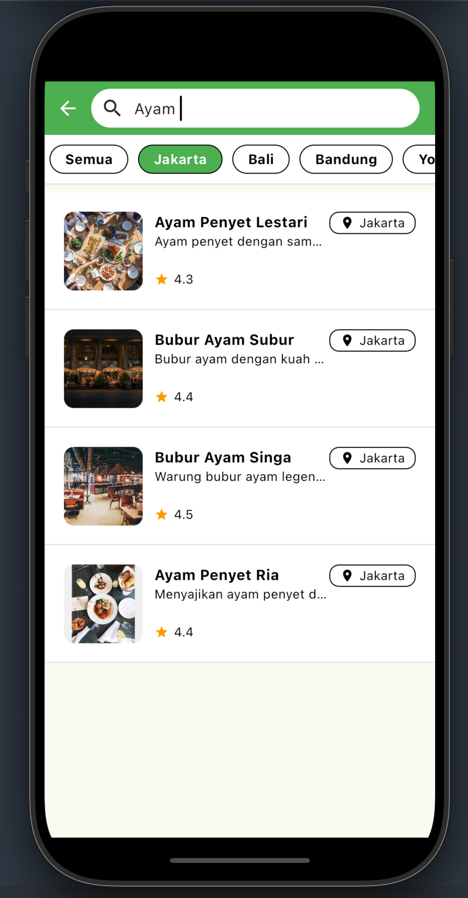</td>
    <td>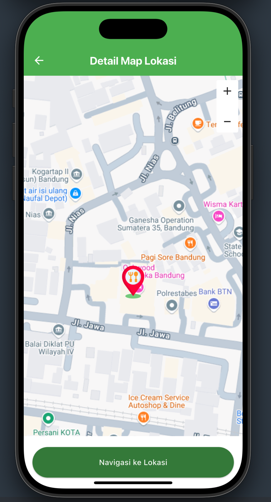</td>
    <td>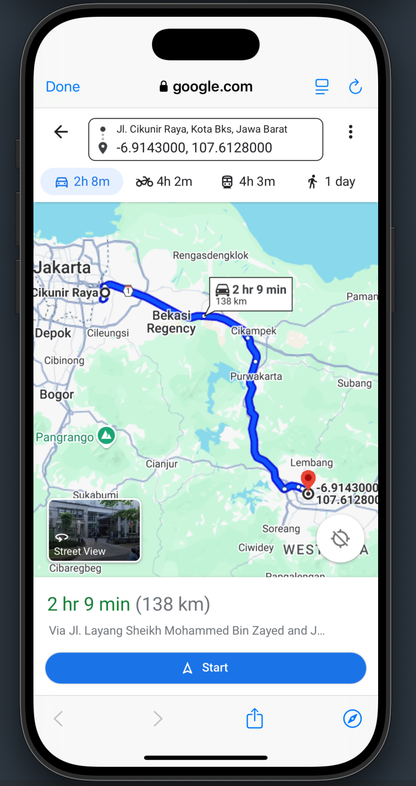</td>
  </tr>
</table>


